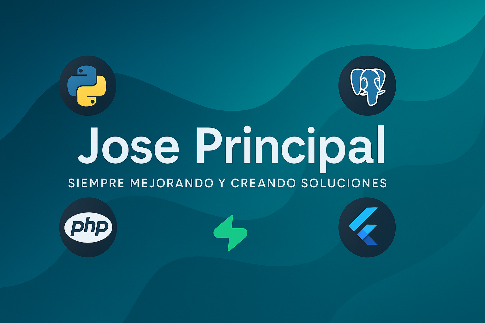
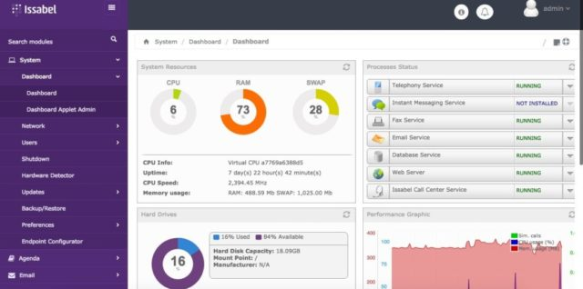

<h1 align="center">Hola 👋, soy Jose Principal</h1>

	
	

<pre>
💻 Desarrollador con experiencia en desarrollo backend con Python y diseño frontend con HTML y CSS.
🧠 Trabajo con bases de datos robustas como SQL Server y PostgreSQL para construir sistemas eficientes.
🚀 Apasionado por la automatización, la creación de herramientas útiles y los sistemas de gestión web.
🌱 En constante aprendizaje sobre nuevas tecnologías y buenas prácticas de desarrollo.
🛠️ Siempre dispuesto a colaborar en proyectos open-source o soluciones personalizadas.
</pre>

---

## 💻 Tech Stack

---

<table>
<tr>
<td width="50%">
<h3 align="center">ChatBoot Autonomo</h3>

</a>
</a>

ChatBot Autónomo diseñado para operar sin supervisión constante. Automatiza conversaciones, responde preguntas frecuentes, gestiona solicitudes, y aprende con el tiempo para mejorar la experiencia del usuario. Ideal para atención al cliente, soporte técnico y sistemas internos.

                                                                                      
</td>

<td width="50%">
                
<h3 align="center">Central Telefonica Issabel</h3>

                                       

 

</a>

📞 Central Telefónica con Issabel PBX
Sistema completo de telefonía IP basado en Asterisk y administrado desde una interfaz web amigable. Issabel permite gestionar extensiones, llamadas internas y externas, IVRs, buzón de voz, grabación de llamadas, reportes, colas de atención y mucho más.
Ideal para empresas que desean una solución de comunicaciones flexible, escalable y de bajo costo.

                                                             
</table>                                                                                 

 

<table>
<tr>
<td width="50%">
<h3 align="center">Sistema Medico Integral</h3>

</a>

El Sistema Médico es una plataforma digital diseñada para optimizar la gestión de pacientes, citas médicas, historial clínico y personal de salud en clínicas, consultorios o centros médicos.
Su objetivo principal es mejorar la atención al paciente y automatizar los procesos administrativos y clínicos mediante una interfaz intuitiva, segura y eficiente.

                                                                                      
</td>       

</table>                                                                                 

 

## 📫 ¡Hablemos!

   &nbsp;&nbsp;
  

---

  Última actualización: 28/06/2025

